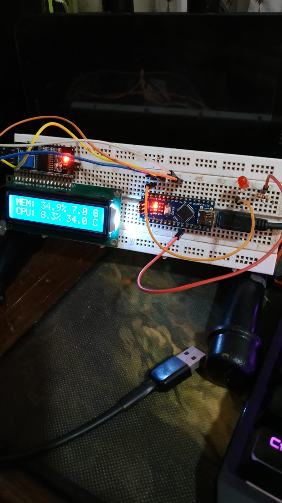
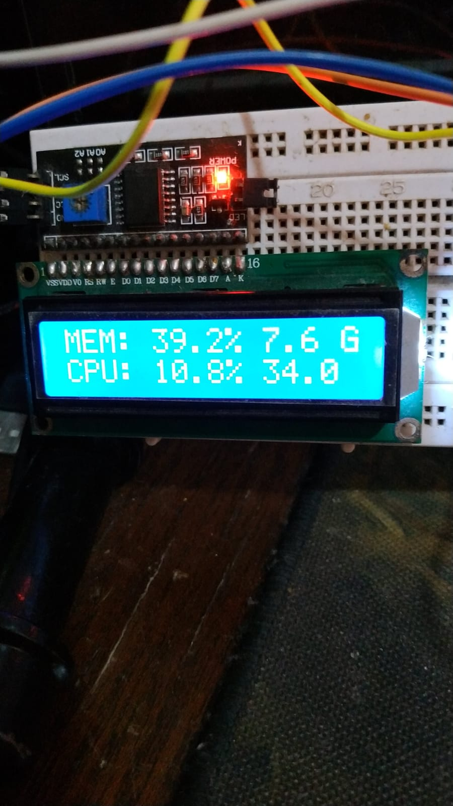

# arduino-python-computer-monitor

> This project is just for test purposes.
I dont pretend update this project.

A small project that i made to manager my memory leak problem.

# Installing

1. Clone this repository
2. pip install pipenv ( install pip env for easy package control )
3. pipenv install ( download and install all libraries that this project uses )
# Small customization

At this moment, you can set a MaxMem limit and configure the hot keys. All this needs
be defined at config.json file
When the memory exceeds the memory limit, arduino nano input 7 is set to HIGH.
So.. you can set a buzzer, or a led to gives you a physical feedback.

# Global hotkey

Somethings we need to stop the info scroll. Soo.. we have global key binding!
1. ctrl+alt+1 to change the
memory view mode on lcd.
2. ctrl+alt+3 Show temperature and
use porcentage of gpu.

# Prototype image:

